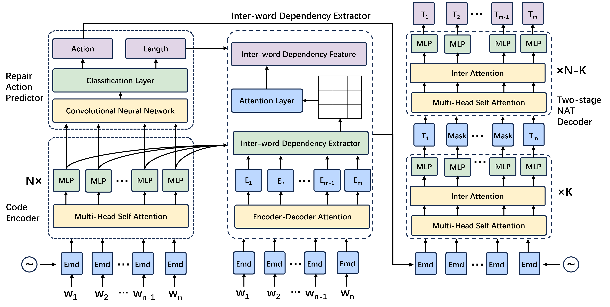
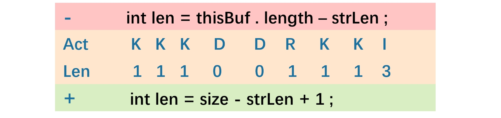

# NARRepair
A PyTorch Implementation of paper "NARRepair:Non-Autoregressive Code Generation Model for Automatic Program Repair". 
## Introduction
Recent years have witnessed a surge of research efforts on Automatic Program Repair(APR), which promises to reduce software development costs and improve software reliability. With the advancement of deep learning techniques and particularly the recent emergence of large language models (LLMs), the performance of APR techniques has reached a new level. Previous deep learning-based APR techniques basically used a sequence-to-sequence model to modify program sentences in the Autoregressive(AR) manner, which predicts future values based on past values. The use of AR manner leads to the inability of real-time repair and huge time delays for repairing real-life complex bugs which typically involves modifications to long code sequence. These two negative consequences overshadow the widespread adoption of APR techniques in real-life software development. 


To address the issues, we in this paper propose NARRepair, the first non-Autoregressive (NAR) code generation model for the APR task. NARRepair is inspired by the abundance of works in machine translation, which generate text in a NAR manner to improve the speed of model inference. However, the naive use of NAR manner in the APR task suffers from the issue of reduced patch quality. To adapt NAR manner for APR tasks, NARRepair features three major novelties. First, NARRepair is guided by repair actions to solve the problem of modifying the correct word into the wrong word. Second, NARRepair employs inter-word dependency information (based on Abstract Syntax Tree) to generate words in parallel while maintaining good fluency. Finally, NARRrepair obtains contextual information about words through two-stage decoding to improve patch accuracy. The results demonstrate that our model can significantly improve the inference speed
without obviously reducing the accuracy of program repair.

## Folder Structure
Our code is written based on the Fairseq framework. Here we only describe the files related to the implementation of our model. If you want to know about other files, please refer to Fairseq's documentation[https://fairseq.readthedocs.io/en/latest/index.html]
```
 ├── Dataset: data used to train and test
 ├── fairseq: the code of fairseq frame
     ├──models/nat/narrepair_nonautoregressive_transformer.py: the code of NARRepair model
     ├──parser: the code of generating AST using Tree-Sitter tool
 ├── narrepair: the code of NARRepair
     ├──narrepair/task: the code of task of NARRepair
     ├──narrepair/model: the code of NARRepair model
     ├──narrepair/criterions: the code of criterions of NARRepair
 ├── narutils: Data preprocessing files
 ├── fairseq_cli: post processing files
 ├── repairact.py: get repair action
```
## Requirements
* Conda
  * install conda: [https://conda.io/projects/conda/en/latest/user-guide/install/index.html](https://conda.io/projects/conda/en/latest/user-guide/install/index.html)
  * Create a new conda environment:
      * if you are running with GPU: 
        ```
        conda env create -f environment-gpu.yml
        conda activate narrepair
        ```
        Dependencies include support for CUDA_11.4. If you are using a different CUDA version update the dependencies accordingly.
      * if you are running with CPU:   
        ```
        conda env create -f environment-cpu.yml
        conda activate narrepair
* Dataset
  * Train dataset
      * Training data can be obtained from：[https://github.com/ASSERT-KTH/SelfAPR]
  * Test dataset
      * Install Defect4J from: [https://github.com/rjust/defects4j]
      * Install QuixBugs from: [https://jkoppel.github.io/QuixBugs/]
## Dependency
* Python >= 3.7
* Pytorch >= 1.5.0
* Fairseq >=1.0.0
* Tree-Sitter
* Transformers>=4.10.0
## Main code introduction
In order to allow readers to read the code of our model more accurately, we briefly introduce the main codes corresponding to the model structure.

The NARRepair model mainly consists of four modules: (1)Code Encoder, (2)Repair Action Predictor, (3)Inter-word Dependency Extractor and (4)Two-stage Decoder.
* (1) NARRepair model: the code to implement the NARRepair model is the NARRepair class in the NARRepair/narrepair/models/narrepair.py file
* (2) Code Encoder: this module will use the encoder part of the transformers model that comes with fairseq. Implemented in the NATransformerEncoder class in the fairseq/models/nat/narrepair_nonautoregressive_transformer file.
* (3) Repair Action Predictor: Implemented in the DurationPredictor class in the fairseq/models/nat/narrepair_nonautoregressive_transformer file.
* (4) Inter-word Dependency Extractor:Implemented in the Biaffine class and ast_link function in the fairseq/models/nat/narrepair_nonautodegrasive_transformer file.
* (5) Two-stage Decoder：Implemented in the NATransformerDecoder class in the fairseq/models/nat/narrepair_nonautoregressive_transformer file.
## Preprocess
Preprocessing is divided into two steps: (1) Obtain the repair actions of the training data (2) Convert the data into binary files.
### Obtain the repair actions
We divide all repair actions into: "insert", "delete", "replace", "keep". And we use dynamic programming method to obtain repair actions.
```
python repairact.py
```
Lines 57 and 61 in the repairact.py file represent the paths of the original error file and the correct file, and lines 68 and 73 represent the output file path. You can modify it according to your own situation.
<p align="center">

</p>

### Convert the data into binary files
The data needs to be converted into binary files in order to train the model.

The parameter data_dir represents the data set path, dict_path represents the dictionary path, and destdir represents the binary file path. You can get the content in the picture below
```
data_dir="data storage directory"
dict_path="the location of the dictionary file"
python ./narutils/preprocess.py --source-lang buggy  --target-lang fixed   \
    --task translation \
    --trainpref $TEXT/train --validpref $TEXT/valid \
    --padding-factor 8 \
    --src-with-werdur \
    --destdir defect4j-bin \
    --srcdict ${dict_path} --tgtdict ${dict_path} \
    --workers 60
```
## Train
Use the obtained binaries to train the model. We trained the model on 4 NVIDIA 3090 environments. The following parameters can be modified according to your actual situation.

The parameter bin_data_dir represents the path to the binary file, and save_path represents the path where the trained model is saved.
```
bin_data_dir="preprocessed binary data"
save_path="the storage location of the trained model"
CUDA_VISIBLE_DEVICES=0,1,2,3 python train.py ${bin_data_dir} --arch narrepair --noise full_mask --share-all-embeddings \
    --criterion narrepair_loss --label-smoothing 0.1 --lr 5e-5 --warmup-init-lr 1e-7 --stop-min-lr 1e-9 \
    --lr-scheduler inverse_sqrt --warmup-updates 4000 --optimizer adam --adam-betas '(0.9, 0.999)' \
    --adam-eps 1e-6 --task narrepair_task --max-tokens 50000 --weight-decay 0.01 --dropout 0.1 \
    --encoder-layers 6 --encoder-embed-dim 512 --decoder-layers 6 --decoder-embed-dim 512 --fp16 \
    --max-source-positions 6000 --max-target-positions 6000 --seed 0 --clip-norm 5 \
    --save-dir ${save_path} --src-embedding-copy --length-loss-factor 0.05 --log-interval 100 \
    --eval-bleu --eval-bleu-args '{"iter_decode_max_iter": 0, "iter_decode_with_beam": 1}' \
    --eval-tokenized-bleu --eval-bleu-remove-bpe \
    --maximize-best-checkpoint-metric --decoder-learned-pos --encoder-learned-pos \
    --apply-bert-init --activation-fn gelu --user-dir narrepair --mlm-layers 2 --batch-size 50 --max-epoch 100 \
    --src-with-werdur --werdur-max-predict 10
```

## Inference
During the inference phase, we use the trained model to fix the buggy program. The parameter checkpoint_path represents the storage path of the trained model, and data_dir represents the test data path.
```
checkpoint_path="the storage location of the trained model"
data_dir="the storage location of the test dataset"
src=buggy
tgt=fixed
CUDA_VISIBLE_DEVICES=0 python fairseq_cli/generate.py ${data_dir} --path ${checkpoint_path} \
 --user-dir narrepair --task narrepair_task --remove-bpe --source-lang ${src} \
 --target-lang ${tgt} --max-sentences 20  --iter-decode-max-iter 0 --iter-decode-force-max-iter \
 --iter-decode-eos-penalty 0 --iter-decode-with-beam 1 --gen-subset test \
```
